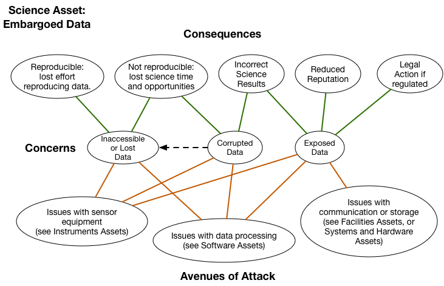
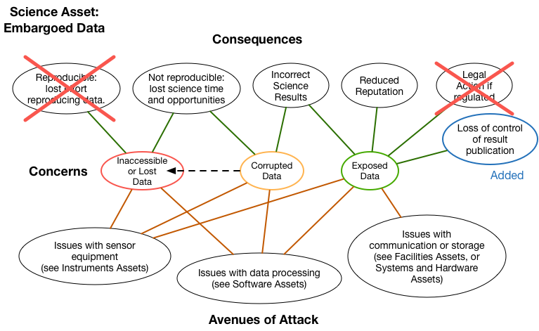
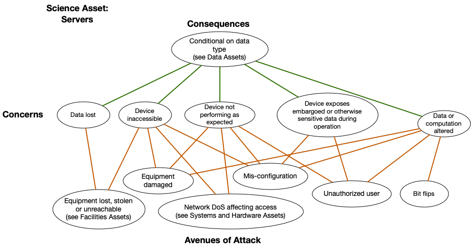

TEST CHANGE - IGNORE

# Open Science Cyber Risk Profile

{{site.time}}

## Table of Contents
1. [Authors](#authors)
2. [Overview and Goals](#overview-and-goals)
3. [Who This Document is Intended For](#who-this-document-is-intended-for)
4. [Introduction](#introduction)
5. [Bad Things Can Happen to Good Science](#bad-things-can-happen-to-good-science)
	* [Examples of Computer Security Incidents Affecting Research](#examples-of-computer-security-incidents-affecting-research)
		- [Untargeted, but disruptive](#untargeted-but-disruptive)
		- [Possibly targeted](#possibly-targeted)
		- [Targeted](#targeted)
6. [How to Use this Document](#how-to-use-this-document)
7. [Usage Example: Embargoed Data Case Study](#usage-example-embargoed-data-case-study)
8. [Common Open Science Assets](#common-open-science-assets)
	* [Data Assets](#data-assets)
	* [Facilities Assets](#facilities-assets)
	* [System and Hardware Assets](#system-and-hardware-assets)
	* [Software Assets](#software-assets)
	* [Instruments](#instruments)
	* [Intangible and Human Assets](#intangible-and-human-assets)
8. [Next Steps](#next-steps)
10. [Conclusions](#conclusions)
11. [Cybersecurity Resources for Open Science](#cybersecurity-resources-for-open-science)
12. [Acknowledgments](#acknowledgments)
13. [License](#license)
14. [Contributing to this Document](#contributing-to-this-document)

<!--<a name="#authors" / >-->

## 1. Authors

This OSCRP is a product of the OSCRP working group. The OSCRP working group is led by [*Sean Peisert*](http://crd.lbl.gov/Q/peisert/) and [*Michael Dopheide*](http://es.net/about/esnet-staff/cybersecurity/michael-dopheide/) from ESnet and [*Von Welch*](https://cacr.iu.edu/about/people/administration/von-welch.php), [*Andrew Adams*](http://staff.psc.edu/akadams/), and [*Susan Sons*](https://cacr.iu.edu/about/people/staff/susan-sons.php) from the NSF Cybersecurity Center of Excellence. Core members of the working group are: [*RuthAnne Bevier (Caltech)*](https://directory.caltech.edu/personnel/thanne), [*Rich LeDuc (Northwestern)*](http://www.kelleher.northwestern.edu/people/staff/item/rich-leduc), [*Pascal Meunier (Purdue HUBzero)*](https://hubzero.org/members/1292), [*Stephen Schwab (USC Information Sciences Institute)*](http://www.isi.edu/people/schwab/about) and [*Karen Stocks (Scripps Institution of Oceanography)*](http://orcid.org/0000-0002-1282-300X). Contributing members are [*Ilkay Altintas (San Diego Supercomputer Center)*](http://swat.sdsc.edu/ilkay/), [*James Cuff (Harvard)*](http://scholar.harvard.edu/jcuff/home), [*Reagan Moore (iRods)*](http://irods.org/2016/06/profile-of-a-data-science-pioneer-dr-reagan-moore/), [*Warren Raquel (NCSA)*](http://www.ncsa.illinois.edu/assets/php/directory/contact.php?contact=wraquel).

For the lastest version and more information about the group, please see [*http://trustedci.github.io/OSCRP/*](http://trustedci.github.io/OSCRP/)

<!--<a name="#executive-summary" / >-->

## 2. Overview and Goals

While Open Science, with its culture of public data, does not have the same cybersecurity concerns as many other sectors such as finance and medicine, it is not free from threats. The Open Science Cyber Risk Profile (OSCRP) is designed to help Principal Investigators (PI) and their supporting Information Technology (IT) professionals assess cybersecurity risks related to Open Science projects. Specifically, it provides a catalog of typical Open Science Assets and the risks associated with those Assets. For those utilizing the [CTSC Cybersecurity Program Guide](http://trustedci.org/guide/), it should expedite the process of inventorying Assets and provide guidance in completing a Risk Assessment Table.

This document achieves these goals by providing a list of information Assets common to Open Science projects, which are meaningful to the science mission of those projects, and for each provides plausible Avenues of Attack for those Assets, with a list of Concerns and Consequences. 

*Avenues of Attack* are means by which an Asset can be impacted. 

*Assets* can include computing systems, data storage systems, networking, digital sensors, scientific and other advanced instruments, scientific data, personnel, and an interoperable suite of software services and tools, including data repositories, visualization environments, and analytic environments. Assets also include the computer-controlled, network-connected elements of physical plants responsible for the safety and security of these systems, such as power and HVAC. 

A *Concern* is a potential negative change to an Asset that impacts the mission of the project. A Concern does not consider the source of the change. For example, the severing of a transatlantic networking link by whatever means would be a negative change that could hamper a project's mission to deliver data to its community and hence for that community to conduct science. A Concern can also be thought of as a risk but without a measure of likelihood. However, in this document, we do not attempt to address likelihood. Therefore, we use the terms "risk" and "Concern" interchangeably; *threat* is another synonym. 

A *Consequence* is the negative effect of a realized Concern on the project mission. It is a synonym for *Impact*. 

The document describes how to use this list of common Assets to understand a project's Concerns, assess them, and begin the process of mitigating them.

Other goals of the document include:

-   Allowing projects to understand the risks associated with their science data so those risks can be addressed in Data Management Plans

-   Allowing NSF projects to address the relevant portion of their responsibilities in the [*NSF Cooperative Agreement Terms & Conditions for Large Facilities*](http://www.nsf.gov/pubs/policydocs/cafatc/cafatc_lf116.pdf) and [*Large Facilities Manual*](https://www.nsf.gov/publications/pub_summ.jsp?ods_key=lfm)

<!-- <a name="#who-this-document-is-intended-for" / > -->

## 3. Who This Document is Intended For

The primary audience of this document is principal investigators (PIs) and information technology (IT) professionals involved in Open Science projects that rely on computing infrastructure (defined broadly as computers, networking, sensors, control systems, etc.) Open Science is defined here as a project working on science that is not classified and for which the results are intended to be communicated publicly. This includes most science funded by NSF, DOE ASCR, and NIH, and may also include some research funded by industry and/or foundations. Open Science may have some data that is not public (e.g., personal health information) or transitorily private for periods of time (e.g., during scientific embargoes, quality assurance, or internal review).

Not every scientific research project has a dedicated or even designated "information technology professional" involved. However, we make the assumption that even such projects typically have a *de facto* IT person. That person may be at the "institutional level" and therefore be almost entirely disconnected from the scientific project, and perhaps even completely unaware of it. In those cases, one of the purposes for this document is to enable PIs to help engage with institutional IT professionals to discuss risks.

A secondary audience for this document is institutional IT professionals (e.g., CIOs, CISOs). While we do not anticipate that institutional IT professionals will necessarily use this document directly, we expect that it may be a useful reference for institutional IT professionals to provide to PIs and research IT professionals within their organization.

We do make the assumption that the institution where Open Science takes place has some kind of security professional at some level,  in addition to a defined or de facto IT person, regardless of whether that person is directly attached to the science project or is at the institutional level.

<!-- <a name="#introduction" / >-->

## 4. Introduction

We read stories daily about computer security incidents. Home Depot. Sony. The U.S. Office of Personnel Management. Hospitals getting hit by ransomware. All of those organizations take security seriously, but are still vulnerable.

Believe it or not, science --- even unclassified, Open Science is vulnerable as well. And indeed, Open Science can at times be particularly vulnerable because Open Science is often so exposed, since by nature there tends to be significant sharing of data, resources, and/or results.

Sometimes, that science is specifically targeted by attackers whose goal is disruption, possibly for political reasons or even simple mischief-making.

At other times, attackers --- perhaps even scientific competitors --- may be interested in seeing data before it is publicly released. Attackers might even be interested in tainting the results of experiments. Finally, computing systems related to science projects can suffer a disruptive security incident without being specifically targeted by an attacker at all, simply by being present on a network, and exploitable.

We assert that something on the order of 80% of "good computer security" results from basic "computer hygiene," such as having multiple backups including some off-site, keeping systems "patched" and up to date, and limiting access controls as much as possible. This document does not cover basic computer hygiene or system administration. This document is intended to cover the *other* 20% that basic hygiene and administration *do not* cover well.

<!--<a name="#bad-things-can-happen-to-good-science" / >-->

## 5. Bad Things Can Happen to Good Science

There are numerous examples of Open Science projects being affected by attacks over computer networks. Some of these attacks have specifically targeted the science projects, while in other examples, science projects have simply been collateral damage. Several real examples, with identifying details removed, are described below. They show that the damage can range
from simple disruption and some loss of work time to significant financial resources spent to repair systems and recover scientific data, significant impact on those projects being able to fulfill their mission. 

Concerns of malicious tampering have historically been organized into three categories: Integrity (e.g. trust), Availability (e.g. accessibility), and Confidentiality (e.g. privacy.) With respect to Integrity, it is critical that scientific outputs be trusted as uncorrupted if they are to be used as the foundation for future science and critical policy decisions. The loss of Availability of valuable data or instruments can slow the scientific process, lead to lost science opportunities (e.g., if data are permanently lost, or a sensor is down during a particular natural phenomenon), be expensive to replace, and lead to embarrassment and a loss of reputation. And finally, even open science projects generally have Confidentiality concerns with respect to embargoed data, such as data that have not been quality assessed or will be released after publication, and restricted data, such as personally identifiable information that Federal regulations prohibit exposing.

<!-- <a name="#examples-of-computer-security-incidents-affecting-research" / > -->

## Examples of Computer Security Incidents Affecting Research

<!-- <a name="#untargeted,-but-disruptive" / > -->

### Untargeted, but disruptive

**5-1.** A vulnerability in the wiki software used by a microelectronics research lab was leveraged by attackers to host pornographic web pages on the wiki, and to send out a large volume of explicit pornographic email messages. The wiki was taken down by its administrators multiple times in an effort to find and remove the underlying exploit left in place by the attackers, which allowed them to continue abusing the site even after initial discovery. The downtime of this wiki, which was heavily used by the lab members and their many external collaborators, had a significant impact on research productivity.  
**Asset:** Documentation (wiki)  
**Concern:** Inaccessible  
**Consequence:** Lost science time (research)

**5-2.** A physics lab and a materials science lab were affected by intrusions into the computers used to control sensitive lab equipment. The intruders gained access via Windows Remote Desktop, which was used heavily by lab members to remotely access these instruments. The intruders used these computers to hide their true location while engaging in social engineering fraud on dating websites. As part of an effort to avoid discovery, intruders deleted all data, including scientific data files, from one of the instrument controller computers. Research operations were disrupted and delayed while the computers were examined, rebuilt and hardened against future intrusions.  
**Asset:** Network-connected scientific control systems (instruments)  
**Concern:** Data loss  
**Consequences:** Lost science time and reduced reputation

**5-3.** A system intended to control a networked sensor array was in the process of being set up when its default login credentials were successfully guessed by a remote attacker. The intruder installed multiple tools on the compromised system, including a utility that would allow control over the hacked system to be retained even after the account used for the initial intrusion was disabled. Using this utility, the intruder issued a remote command to the compromised controller system that invoked a second tool, a "flooder" intended for use in a network-based denial-of-service attack against an off-site target. Once activated, the flooder generated a tremendous volume of outbound attack traffic, saturating its own network and rendering the local site's own border link unusable. Only after the site's network external network connectivity was lost was the compromised server and its running flooder tool discovered.

**Asset:** Network-connected sensor control system; Network infrastructure  
**Concern:** Inaccessible network  
**Consequences:** Lost science time, affecting unrelated projects at the same facility, reduced reputation

**5-4.** A lab member received an email message stating that a bill is overdue and referencing an attached invoice. The attachment included an embedded malicious Word macro, which downloads and installs a program that encrypts commonly-used data files located on all mounted drives ("ransomware"). The computer on which the lab member opened the attachment was a personal laptop on a home network. The lab member closed the laptop while the ransomware was still executing, not realizing anything was wrong. At work, the lab member opened up the laptop and mounted the lab's research file share as usual. All lab members had read/write permissions to this volume, so the ransomware, executing under the lab member's permissions, encrypted all data files present on the research file share. Rather than attempt to pay the amount in Bitcoin demanded by the ransom letter left on the file share by the malicious software, the lab elected to restore the volume from backup, and live with the loss of any data files created between time of encryption and the most recent backup.

**Asset:** Network-attached storage device; lab member's personal computer  
**Concern:** Inaccessible or lost research data  
**Consequences:** Lost science time

<!-- <a name="#possibly-targeted" / > -->

### Possibly targeted

**5-5.** A group of hackers gained access to a vulnerable scientific computing cluster at University A and quickly determined that these computers were used by collaborators at other universities. The intruders used credentials captured on systems at University A to get into multiple compute clusters in research labs at University B and University C, collecting new captured credentials along the way and gaining additional access to other university systems. Compromised systems were down and unusable for several days in waves at the affected sites, while IT and Information Security personnel investigated the intrusions and rebuilt the affected systems. Users were affected by the downtime and urgent credential change requirements -- in same cases, more than once while the nature of the intrusions was still being investigated. Affected systems were re-hacked during this incident as a result of some privileged users' failure to change credentials. Investigation and remediation were complicated further at University A because the research project these systems served involved a physically remote location with poor network connectivity. At the time the intrusion was discovered, all personnel directly familiar with the configuration and management of these systems were at the remote location, with little in the way of explanatory documentation left for local IT staff to rely on while attempting to investigate and resolve the incident. Downtime, widespread credential changes, and general confusion all impacted the research project.

**Assets:** Servers (compute clusters), staff computing & networking and networks  
**Concerns:** Devices inaccessible and devices exposing sensitive information and transport prevented  
**Consequences:** Lost science time

<!-- <a name="#targeted" / > -->

### Targeted

**5-6.** A politically controversial project (the building of a new large-scale telescope) was subjected to attack by "hacktivists" who generated large quantities of protest mail to the mailboxes of the officers of the project and the project's informational contact address, rendering these mailboxes unusable due to the volume of messages. Protesters also engaged in distributed denial-of-service attacks against the project's website, repeatedly knocking it offline. This made communication between the project and its supporters, the media, and citizenry who wished to learn more about the controversy extremely difficult.  
**Assets:** Servers (mail) and networks  
**Concerns:** Devices inaccessible and transport prevented  
**Consequences:** Lost science time and reduced reputation

**5-7.** The primary mail server for a university's climate research group was hacked by protesters, who then copied off the mail from this server and made it public shortly before a scheduled world summit on climate change. Subsequent media reports accused researchers (who said their words in private email messages were taken out of context) of fraud and conspiracy. In addition to the immediate impact of the security incident on the mail server and its usability, the aftermath of the intrusion included multiple separate fraud and misconduct investigations. Although these investigations failed to substantiate allegations of fraud, public confidence in climate change research was damaged.  
**Asset:** Internal data  
**Concern:** Data exposed  
**Consequences:** Reduced reputation and legal action

The point we emphasize with these examples is that computer security-related Consequences in Open Science can be as important as Consequences elsewhere, and researchers should not assume that simply because data are eventually intended to be published openly that they should not care about computer security. Nor should researchers assume that their institutions will protect them—at least not without active engagement between the PI and the institution.

<!-- <a name="#how-to-use-this-document" / > -->

## 6. How to Use this Document

The following sections of this document provides a list of common Open Science Assets. Each Asset is critical to a project's science mission in some way such that it represents a set of Concerns. That is, if the Asset is negatively impacted in some manner, it reduces the project's ability to carry out its mission.

In this section, we describe how to use this list of common Assets to understand a project's Concerns, assess them, and begin the process of mitigating them.

The following are the intended steps for using this document. The expectation is that the first two steps are accomplished by the project PI working in collaboration with the project's designated cybersecurity lead. Subsequent steps are accomplished by the project cybersecurity lead.

*Intended Steps to Use this Document*

1.  Identify the stakeholders of the science project --- at the very least, this includes the principal investigator(s) and science team; other researchers, including possible external users; the institution that owns or manages the science instrument, the project, and the mission it supports; and possibly human subjects of the science project.

2.  Create an Asset inventory for the project by looking through the list in the "Common Open Science Assets" section, and identifying all the Assets relevant to the Open Science project.

3.  For each mission critical science Asset, examine the Concerns, Consequences, and Avenues of Attack diagram associated with the Asset and note which Concerns and Consequences are relevant to the project, and the extent to which they are relevant

4.  For each relevant Concern note the vectors that could cause the Concern to be realized.

**While *mitigations* are outside the scope of this document, the process of identifying key Assets and avenues of attack is intended to help guide scientists and IT professionals in pursuing risk-justified controls to mitigate avenues of attack via other sources. Note that the CTSC can help identify these external sources here, as well.**

5.  Work with IT professionals to agree on and implement agreed controls (protections against Concerns) or other means of mitigating risk.

6.  Repeat this assessment annually, or more frequently if the project’s Assets or risks have changed.

<!-- <a name="#embargoed-data-case-study" / > -->

## 7. Usage Example: Embargoed Data Case Study

To demonstrate how to carry out the risk profile steps, we'll pretend we are the PI for a small science project that has two telescopes tracking changes in the night sky over time.  In *Step 1* of the process flow, we identify the stakeholders as our immediate project team, a collaborating research team, and the institutions that house the two telescopes.  The stakeholders may be brought in to help with the remaining steps as well as to discuss the results.

In *Step 2* we go through the Asset Catalogue below and select Assets relevant to our project.  As we select our Assets, we include brief descriptions of the precise project Asset we're referring to.

We believe the following Assets apply to our project:

-   Embargoed Data:  Due to the funding sources and collaborators involved, it's important to the stakeholders that any potential discoveries made by this project have time to be vetted by appropriate experts and carefully released to the public.  Specifically, the triangulated location of small and medium-sized near Earth objects should be kept secure for the private analysis of project scientists.

-   Staff Computing & Networking:   The workstations, laptops, and connectivity of project staff and any outside collaborators.

-   Telescopes: Our telescopes have network-connected control system that allows for remote collaborators to adjust parameters.  Both telescopes are considered similar, but separate Assets due to their placement at different institutions.

-   File-store:   The data from the telescope as well as preliminary results are stored on a central data storage system.

*Step 3* begins after the Assets have been identified.  For this example, we select just one of our Assets --- Embargoed Data --- and examine its Consequences, Concerns and Avenues of Attack diagram:

From this diagram, select the Concerns and Consequences that are most relevant to your project.  It is often helpful to color code your own copy of the diagram to help portray these decisions and well as their relative importance.  By focusing on the Consequences that are most important to the project, it will automatically lead us to the Avenues of Attacks that we will want to be most concerned about.  This will help prioritize later actions.

In this sample case, we've selected that we are most concerned about lost data (red) with corrupted data (orange) being a close second.  While we prefer our data to be embargoed, it would not be the end of the world if it happened to get exposed (green).  Next we are assuming for our example that it's impossible to reproduce new data so the first Consequence from the reference diagram is removed, as well as the possibility of legal action.  However, we've decided that data exposure would result in another Consequence so we've added a custom one, "loss of control of result of publication," in blue.

We see in the diagram that the Avenues of Attack for embargoed data
reference other Assets that are the likely cause of a problem.  This
may help identify more Assets that we hadn't previously
considered.  Let's follow one of those paths to see where it leads.
On the bottom right, we see the Servers Assets could lead to
exposed data, so we pull up the Servers Asset diagram:

Looking at the Servers Asset we are presented with several more
Concerns and Avenues of Attack.  As you can see, by starting with our
Concerns about data and the possible Consequences we care about as
scientists, we are able to follow the diagrams and end up with a
mapping to possible Avenues of Attack.

For your project, you'll repeat Step 3 for each identified Asset. This
will make it easier to think about and discuss (with
your stakeholders and IT/cyber security lead) what can be done to
mitigate those Avenues of Attack, focusing on those that address your
highest Concerns.  In addition, try to think about what other Avenues
of Attack may be possible that are unique to your environment.

<!--
(side note:  Corrupted Data could be both corrupted data you know about and corrupted data you don't know about.)... 
-->
   
<!-- <a name="#common-open-science-assets" / > -->

## 8. Common Open Science Assets 

In this section we list common Open Science Assets and provide a diagram for each that provides a connection between the Concerns and Consequences from the perspective of the project mission and the Avenues of Attack that provide guidance to the cybersecurity lead in mitigating the Concerns regarding the Asset.

<!-- <a name="#data-assets" / > -->

## Data Assets

**Data** includes what we traditionally define as "data", i.e., raw data, derived data, as well as algorithms, protocols, configuration, accounting, personal or management data.

-   [*Public Data*](assets/Public-Data/): Published generated or collected Open Science data

-   [*Embargoed Data*](assets/Data/): Open Science data that has not yet been publicly released

-   [*Internal data*](assets/InternalData/): Data that is never intended to be published.  This includes: generated or derived data (usually intermediate computational results), e-mails or notes

-   [*Documentation*](assets/Documentation/): Manuals, wikis, blogs, etc. that facilitate the production, post-processing or management of Assets

-   [*Accounting Information*](assets/AccountingInformation/): Logs and databases recording the production, post-processing or management of Assets

-   [*For Approved Access Only*](assets/ForApprovedAccessOnly/): Project/personnel data necessary for the Open Science mission

<!-- <a name="#facilities-assets" / > -->

## Facilities Assets

-   [*Facilities*](assets/Facilities/): Physical storage, power & climate control used to house Assets

<!--  Institutional owned equipment-->

-   [*Staff computing & networking*](assets/Institution-systems/): Institutional systems used by staff to access Assets, e.g., desktops, laptops, smartphones and the infrastructures they leverage (also mailing lists, calendars)

    - Note, the **risk** associated with this Asset is absorbed by the institution that owns them, not the project, but it is useful for the project to understand the greater risks involved 

<!-- <a name="#system-and-hardware-assets" / > -->

## System and Hardware Assets

-   [*Networks*](assets/Networks/): Infrastructure used to access or transport data

-   [*File-store*](assets/File-Store/): System to archive data

-   [*Front-end*](assets/Front-end/): System to access archived data, usually web-based

-   [*Back-end*](assets/Back-end/): System to search data, usually a database or source repository

-   [*User Portal*](assets/User-portal/): System enabling users to initiate production or post-processing of data

-   [*Servers*](assets/Servers/): Systems used to access, store, produce and/or manipulate other Assets

-   [*Desktops*](assets/Desktops/): Systems used to access, store, produce and/or manipulate other Assets

-   [*Laptops*](assets/Laptops/): Systems used to access, store, produce and/or manipulate other Assets

-   [*Mobile devices*](assets/MobileDevices/): Systems used to access other Assets (tablets, smartphones, smartwatches)

<!-- <a name="#software-assets" / > -->

## Software Assets

-   [*3rd Party*](assets/Third-party-software/): External applications, algorithms, models, e.g., computation / analysis, used by the project

-   [*Internal software*](assets/Internal-software/): Applications, algorithms, or models produced internally, can include:

    -   Restricted software, algorithms, or models ("secret sauce" - competitive/intellectual property)

    -   Non-restricted software, algorithms, or models developed and used by the organization

<!-- -   Middleware: ??? -->

<!-- <a name="#instruments" / > -->

## Instruments

-   [*Sensors*](assets/Sensors/): Sensor instruments (e.g., network-connected neutrino collectors)

-   [*Network-connected scientific control systems (e.g., microscopes, telescopes, light sources, particle accelerators)*](assets/Network-connected-scientific-control-systems/)

<!-- <a name="#intangible-and-human-assets" / > -->

## Intangible and Human Assets

-   [*Project Reputation*](assets/Project-Reputation/): Credibility associated with an organization

-   [*Staff*](assets/Staff/): People involved in the production, post-processing or management of Assets

-   [*Collaboration*](assets/Collaboration/): Meetings and agendas used by staff to coordinate the production, post-processing or management of Assets

-   [*Workflow*](assets/Workflow/): The process or protocols by which science is achieved within a project

-   [*Financial*](assets/Financial/): The financial assets owned by a project

<!--<a name="#next-steps" / > -->

## 9. Next Steps

As mentioned earlier, this document focuses on the process of identifying key scientific Assets and understanding some of the key risks that those Assets may be vulnerable to. However, this document does not attempt to address the process of actually mitigating Concerns. This document aims to enable the PI or information technology lead to go through the process of assessing computer security related Concerns and Avenues of Attack, in order to help them have a dialogue with personnel with cybersecurity expertise who *can* actually assist with mitigation steps by implementing appropriate protections.

<!--<a name="#conclusions" / >-->

## 10. Conclusions

Open Science, despite having a culture of public data and open collaboration, still faces cybersecurity-related threats. This document aids Principal Investigators and their supporting IT professionals in assessing cybersecurity risks through a catalog of typical Open Science Assets and the common risks associated with those Assets.

<!-- <a name="#cybersecurity-resources-for-open-science" / > -->

## 11. Cybersecurity Resources for Open Science

For projects that need assistance, here are some resources to consider:

-   The NSF Cybersecurity Center of Excellence: [*http://trustedci.org/help/*](http://trustedci.org/help/)
-   [The EDUCAUSE IT Risk Register](https://library.educause.edu/resources/2015/10/it-risk-register)

## 12. Acknowledgments
We thank the National Science Foundation (grant 1547272) for supporting our work.

Sean Peisert and Michael Dopheide's work on this effort was supported by the Director, Office of Science, Office of Advanced Scientific Computing Research, of the U.S. Department of Energy under Contract No. DE-AC02-05CH11231. Karen Stocks' work was supported by NSF OCE award 1327683 for the Science Support Office of the International Ocean Discovery Program. 

This research was carried out in collaboration with the National Resource for Translational and Developmental Proteomics under Grant P41 GM108569 from the National Institute of General Medical Sciences, National Institutes of Health.

The working group thanks Tanya Berger-Wolf, Matt Jones, Fred Luehring, and Alex Withers for their presentations on the topic of science risks.

Any opinions, findings, conclusions, or recommendations contained herein are those of the authors and should not be interpreted as necessarily representing the official policies or endorsements, either expressed or implied, of any of the sponsors of this work, employers of the authors, or any other organization.

## 13. License

This document is distributed under a [Attribution 4.0 International (CC BY 4.0) License](https://creativecommons.org/licenses/by/4.0/).

## 14. Contributing to this Document

This document is [hosted in GitHub](https://github.com/trustedci/OSCRP) to encourage the community to make contributions of new Assets and other improvements. One needs [a free GitHub account](https://help.github.com/articles/signing-up-for-a-new-github-account/) to contribute. Your options for doing so are:

1. Point out a problem or make a suggestion by [creating a issue](https://github.com/trustedci/OSCRP/issues).
2. Author changes or additions by [creating a fork and push your changes](https://help.github.com/categories/collaborating-with-issues-and-pull-requests/).
