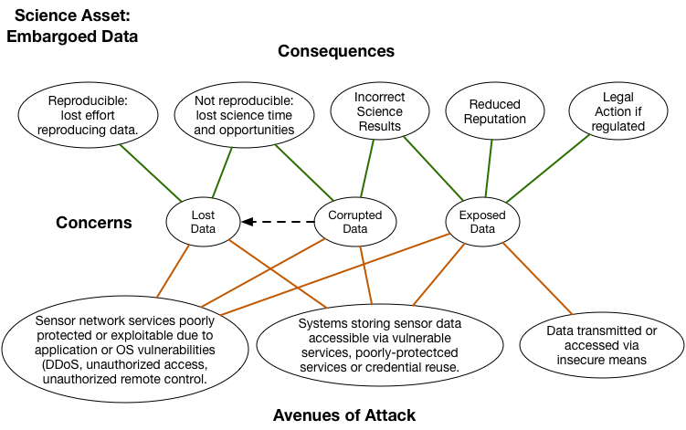

# Open Science Cyber Risk Profile

## Table of Contents
1. [Authors](#authors)
2. [Executive Summary](#executive-summary)
3. [Who This Document is Intended For](#who-this-document-is-intended-for)
4. [Introduction](#introduction)
5. [Bad Things Can Happen to Good Science](#bad-things-can-happen-to-good-science)
	* [Examples of Computer Security Incidents Affecting Research](#examples-of-computer-security-incidents-affecting-research)
		- [Untargeted, but disruptive](#untargeted-but-disruptive)
		- [Possibly targeted](#possibly-targeted)
		- [Targeted](#targeted)
6. [How to Use this Document](#how-to-use-this-document)
7. [Definitions of Terms](#definitions-of-terms)
8. [Usage Example: Embargoed Data Case Study](#usage-example-embargoed Data-case-study)
9. [Common Open Science Assets](#common-open-science-assets)
	* [Data Assets](#data-assets)
	* [Facilities and Hardware Assets](#facilities-and-hardware-assets)
	* [Software Assets](#software-assets)
	* [Instruments](#instruments)
	* [Intangible and Human Assets](#intangible-and-human-assets)
10. [Next Steps](#next-steps)
11. [Conclusions](#conclusions)
12. [Cybersecurity Resources for Open Science](#cybersecurity-resources-for-open-science)

<!--<a name="#authors" / >-->

## Authors

This OSCTP is a product of the OSCTP working group. The OSCTP working group is led by [*Sean Peisert*](http://crd.lbl.gov/Q/peisert/) and [*Michael Dopheide*](http://es.net/about/esnet-staff/cybersecurity/michael-dopheide/) from ESnet and [*Von Welch*](https://cacr.iu.edu/about/People/administration/von-welch.php), [*Andrew Adams*](http://staff.psc.edu/akadams/), and [*Susan Sons*](https://cacr.iu.edu/about/People/staff/susan-sons.php) from the NSF Cybersecurity Center of Excellence. Members of the working group are: [*Ilkay Altintas (San Diego Supercomputer Center)*](http://swat.sdsc.edu/ilkay/), [*RuthAnne Bevier (Caltech)*](https://directory.caltech.edu/personnel/thanne), [*James Cuff (Harvard)*](http://scholar.harvard.edu/jcuff/home), [*Rich LeDuc (Northwestern)*](http://www.kelleher.northwestern.edu/people/staff/item/rich-leduc), [*Pascal Meunier (Purdue HUBzero)*](https://hubzero.org/members/1292), [*Reagan Moore (iRods)*](http://wiki.irods.org/index.php/Reagan_Moore), [*Stephen Schwab (USC Information Sciences Institute)*](http://www.isi.edu/people/schwab/about) and [*Karen Stocks (Scripps Institution of Oceanography)*](http://orcid.org/0000-0002-1282-300X).

For the lastest version and more information about the group, please see [*http://trustedci.github.io/OSCTP/*](http://trustedci.github.io/OSCTP/)

<!--<a name="#executive-summary" / >-->

## Executive Summary

While Open Science, with its culture of public data, does not have the same cybersecurity concerns as many others sectors such as finance, medical, etc., it is not free from threats. The Open Science Cyber Threat Profile (OSCTP) is designed to aid Principal Investigators and their supporting IT professionals assess cybersecurity risks related to open science projects. Specifically, it provides a catalog of typical open science assets and the risks associated with those assets. For example, for those utilizing the CTSC Cybersecurity Program Guide,[1] this should expedite the process of inventorying assets and provide guidance in completing a Risk Assessment Table.

This document achieves these goals by providing a list of information assets common to open science projects, which are meaningful to the science mission of those projects, and for each provides plausible avenues of attack for those assets, with a list of concerns and consequences. The document describes how to use this list of common assets to understand a project's concerns, assess them, and begin the process of mitigating them.

Other goals of the document include:

-   Allowing projects to understand the risks associated with their science data so those risks can be addressed in Data Management Plans

-   Allowing NSF projects to address the relevant portion of their responsibilities in the [*NSF CA T&C for Large Facilities*](http://www.nsf.gov/pubs/policydocs/cafatc/cafatc_lf116.pdf) and [*Large Facilities Manual*](https://www.nsf.gov/publications/pub_summ.jsp?ods_key=lfm)

<!-- <a name="#who-this-document-is-intended-for" / > -->

## Who This Document is Intended For

The primary audience of this document is intended to be principal investigators (PIs) of "open science" projects involving computing infrastructure of any type (computing, networking, sensors, control systems, etc...), as well as information technology professionals involved in scientific research projects. Open science is defined here as "a project working on science that is not classified and for which the results are intended to be communicated publicly. This includes most science funded by NSF, DOE ASCR, and NIH, and may also include some research funded by industry and/or foundations."

Not every scientific research project involving computing has a dedicated or even designated "information technology professional" involved. However, we make the assumption that even such projects typically have a *de facto* IT person. That person may be at the "institutional level" and therefore be almost entirely disconnected from the scientific project, and perhaps even completely unaware of it. In those cases, one of the purposes for this document is to enable PIs to help engage with institutional IT professionals to discuss risks.

A secondary audience for this document is institutional IT professionals (e.g., CIOs, CISOs). While we do not anticipate that institutional IT professionals will necessarily use this document directly, we expect that it may be useful for institutional IT professionals to provide to PIs and research IT professionals within their organization.

We do make the assumption that the institution where open science takes place has some kind of security professional at some level, regardless of whether that person is directly attached to the science project or is at the institutional level.

<!-- <a name="#introduction" / >-->

## Introduction

We read stories daily about computer security incidents. Home Depot. Sony. The U.S. Office of Personnel Management. Hospitals getting hit by ransomware. All of those organizations take security seriously, but are still vulnerable.

Believe it or not, science --- even "open," unclassified science is vulnerable as well. And indeed, "open science" can at times be particularly vulnerable because "open science" is often so exposed, because by nature there tends to be significant sharing of data, resources, and/or results.

Sometimes, that science is specifically targeted by attackers who are interested in doing nothing more than causing a little mayhem on the side.

At other times, attackers --- perhaps even scientific competitors --- may be interested in seeing data before it is publicly released. Attackers might even be interested in tainting the results of experiments, too. Finally, there may well be times when computing systems related to science projects are the innocent bystanders who are nonetheless the victims of "malware" that is simply ever-present on the Internet.

We assert that something on the order of 80% of "good computer security" results from basic "computer hygiene," such as having multiple, backups including some off-site, keeping systems "patched" and up to date, and limiting access controls as much as possible. This document does not cover basic computer hygiene or system administration. This document is intended to cover the *other* 20% that basic hygiene and administration *do not* cover well.

<!--<a name="#bad-things-can-happen-to-good-science" / >-->

# Bad Things Can Happen to Good Science

There are numerous examples of open science projects being affected by attacks over computer networks. Some of these attacks have specifically targeted the science projects, while in other examples, science projects have simply been collateral damage. "Damage" has ranged from simple disruption and some loss of work time to vast amounts of money spent to attempt to repair systems and recover scientific data. A handful of real examples are discussed in this section.

Computing systems of all kinds can fail due to accident, error, natural events, or due to malicious tampering. Consequences of computing system failure due to malicious tampering have historically been organized into three categories: confidentiality, integrity, and availability. Failures in open science projects relating to each of those categories can have significant impact on those projects being able to fulfill their mission.

The United States funds billions of dollars of scientific research each year. Regarding scientific integrity, "Much of that research has results that are purely scientific, while some of the research findings, including those from computational results, can also inform national policy decisions. ... Even for the basic science, since U.S. taxpayer dollars fund a large cadre of the nation's top scientists to do research, it is vital that the results can ultimately be trusted."[2]

Aside from integrity, while some "open science" is done entirely in the open, suppose certain results were released before they were intended for publication? The results could range from embarrassment to intellectual property theft to violation of the terms of scientific embargoes. And, even "open" projects generally have restricted data, such as personally identifiable information that Federal regulations prohibit exposing. Perhaps more important to the institution is who is accountable when something goes wrong.

Or regarding "availability," what if a scientific instrument were unavailable for an extended period of time, or had unpredictable availability so that the instrument could not be trusted? Or what if a key data set used by the public went offline of a period of time, and hindered critical work by other researchers?
Finally, what if a key server being used by a research group was wiped clean and a month or a year of data was lost?

The point we emphasize in this document is that computer security-related consequences in "open science" can be as important as consequences elsewhere, and researchers should not assume that simply because are eventually intended to be published openly that they should not care about computer security. Nor, should researchers assume that their institutions will protect them --- at least not without active engagement between the PI and the institution.

<!-- <a name="#examples-of-computer-security-incidents-affecting-research" / > -->

## Examples of Computer Security Incidents Affecting Research

<!-- <a name="#untargeted,-but-disruptive" / > -->

### Untargeted, but disruptive

A vulnerability in the wiki software used by a microelectronics research lab was leveraged by attackers to host pornographic web pages on the wiki, and to send out a large volume of explicit pornographic email messages. The wiki was taken down by its administrators multiple times in an effort to find and remove the underlying exploit left in place by the attackers, which allowed them to continue abusing the site even after initial discovery. The downtime of this wiki, which was heavily used by the lab members and their many external collaborators, had a significant impact on research productivity.  
**Asset:** Documentation (wiki)  
**Concern:** Inaccessible  
**Consequence:** Lost science time (research)

A physics lab and a materials science lab were affected by intrusions into the computers used to control sensitive lab equipment. The intruders gained access via Windows Remote Desktop, which was used heavily by lab members to remotely access these instruments. The intruders used these computers to hide their true location while engaging in social engineering fraud on dating websites. As part of an effort to avoid discovery, intruders deleted all data, including scientific data files, from one of the instrument controller computers. Research operations were disrupted and delayed while the computers were examined, rebuilt and hardened against future intrusions.  
**Asset:** Network-connected scientific control system (instruments)  
**Concern:** Data loss  
**Consequences:** Lost science time and reduced reputation

<!-- <a name="#possibly-targeted" / > -->

### Possibly targeted

A group of hackers gained access to a vulnerable scientific computing cluster at University A and quickly determined that these computers are used by collaborators at other universities. The intruders use credentials captured on systems at University A to get into multiple compute clusters in research labs at University B and University C, collecting new captured credentials along the way and gaining additional access to other university systems. Compromised systems were down and unusable for several days in waves at the affected sites, while sysadmins and security personnel investigated the intrusions and rebuilt the affected systems. Users were affected by the downtime and urgent credential change requirements -- in same cases, more than once while the nature of the intrusions was still being investigated. Affected systems were re-hacked during this incident as a result of some privileged users' failure to change credentials.

A group of very fast-moving intruders gained access to systems in Astronomy departments at numerous universities using techniques similar to the above. A core group of computers that were compromised and running Trojaned SSH binaries were associated with a research project being run from a physically remote location with poor network connectivity, and at the time the intrusion was discovered, ALL personnel directly familiar with the configuration and management of these systems were at that location, which greatly hampered investigation and recovery, and extended the period of down time for these systems. Most of the systems involved were run by scientists, not system administrators, who understandably prioritized science over system management and documentation. System names were reused several times, and in some cases servers back at the university had names that indicated a connection with the project, when in fact there was no current relationship with the project. Downtime, widespread credential changes, and general confusion all impacted the research project.

<!-- <a name="#targeted" / > -->

### Targeted

A politically controversial project (the building of a new large-scale telescope) was subjected to attack by "hacktivists" who generated large quantities of protest mail to the mailboxes of the officers of the project and the project's informational contact address, rendering these mailboxes unusable due to the volume of messages. Protesters also engaged in distributed denial-of-service attacks against the project's website, repeatedly knocking it offline. This made communication between the project and its supporters, the media, and citizenry who wished to learn more about the controversy extremely difficult.

The primary mail server for a university's climate research group was hacked by protesters, who then copied off the mail from this server and made it public shortly before a scheduled world summit on climate change. Subsequent media reports accused researchers (who said their words in private email messages were taken out of context), of fraud and conspiracy. In addition to the immediate impact of the security incident on the mail server and its usability, the aftermath of the intrusion included multiple separate fraud and misconduct investigations. Although these investigations failed to substantiate allegations of fraud, public confidence in climate change research was damaged.

<!-- <a name="#how-to-use-this-document" / > -->

## How to Use this Document

The following sections of this document provides a list of common open science assets. Each asset is critical to a project's science mission in some way such that it represents a set of concerns. That is, if the asset is negatively impacted in some manner, it reduces the project's ability to carry out its mission.

In this section, we describe how to use this list of common assets to understand a project's concerns, assess them, and begin the process of mitigating them.

The following are the intended steps for using this document. The expectation is that the first two steps are accomplished by the project PI working in collaboration with the project's designated cybersecurity lead. Subsequent steps are accomplished by the project cybersecurity lead.

*Intended Steps to Use this Document*

1.  Identify the "stakeholders" of the science project --- at the very least, this includes the principal investigator(s) and science team; other researchers, including possible external users; the institution that "owns" the science instrument, the project, and the "mission" it supports; and possibly human subjects of the science project.

2.  Create an asset inventory for the project by looking through the list of common assets in the "Common Open Science Assets" section, and identifying all the assets relevant to the open science project.

3.  For each "mission critical" science asset, examine the Concerns, Consequences, and Avenues of Attack diagram associated with the asset and note which concerns and consequences are relevant to the project, and the extent to which they are relevant

4.  For each relevant concern note the vectors that could cause the concern to be realized.

5.  **While *mitigations* are outside the scope of this document, the process of identifying key assets and avenues of attack is intended to help guide scientists and IT professionals in pursuing risk-justified controls to mitigate avenues of attack via other sources. Note that the CTSC can help identify these external sources here, as well.**

6.  Work with IT professionals to Implement agreed upon controls or some other means of mitigating risk.

7.  Incorporate an annual refresh of this process into the project's activity cycle. Specifically considering if a project's assets have change, or the potential impact of the risks to the project has changed in such a way the project's risk profile may have changed.

<!-- <a name="#definitions-of-terms" / > -->

# Definitions of Terms

The following terms are used by the OSCTP with particular meaning as given.

-   *Open Science Project*: A project working on science that is not classified and for which the results are intended to be communicated publicly. This includes most science funded by NSF, DOE ASCR, and NIH, and may also include some research funded by industry and/or foundations. This research typically takes place at universities, government labs, and some non-profit research organizations. "Open science" may have some data that is not public (e.g., personal health information) or transitorily private private for periods of time (e.g., during scientific embargoes, quality assurance, or internal review).

-   *Asset*: "Assets" are computing systems, data storage systems, networking, digital sensors, scientific and other advanced instruments, scientific data, personnel, and an interoperable suite of software services and tools, including data repositories, visualization environments, and analytic environments. Assets also include the computer-controlled, network-connected elements of physical plants responsible for the safety and security of these systems, such as power and HVAC.

-   *Project Mission*: what the project is intended to do. This implicitly or explicitly defines what kind of changes (e.g., due to attack) are considered negative.

-   *Concern*: A potential negative change to an Asset that impacts the mission of the project. A threat does not consider the source of the change. For example, the severing of a transatlantic networking link by whatever means would be a negative change that could hamper a project's mission to deliver data to its community and hence for that community to conduct science.

    -   Synonym for *Threat* in cybersecurity nomenclature.

    -   A Concern can also be thought of as a risk but without a measure of likelihood. However, in this document, we do not attempt to address likelihood. Therefore, we use the terms "risk" and "concern" in this document interchangeably.

    -   Concerns are often expressible using:

        -   *Integrity*: The need to trust in an asset, e.g., if an asset becomes corrupted, then its integrity is diminished

        -   *Confidentiality*: The process or need to conceal all or some aspect of an asset

        -   *Availability*: The process or need to keep an asset accessible/operational

-   *Consequences*: The negative effect of a realized Concern on the Project Mission.

    -   Synonym for *Impact.*

-   *Controls*: Protection mechanisms that attempt to enforce the security goals with respect to the project mission to prevent Concerns from taking place

-   *Exposure*: Loss of confidentiality

-   *Avenues of Attack*: One or more means by which an Asset can be impacted.

    -   Synonym for *Attack Surface* in cybersecurity nomenclature.

<!-- <a name="#embargoed-data-case-study" / > -->

# Usage Example: Embargoed Data Case Study

For this example we'll pretend we are the PI for a small science project that has a couple telescopes tracking changes in the night sky over time.  In *Step 1* of the process flow, we identify the stakeholders as our immediate project team, a collaborating research team, and the institutions that house the two telescopes.  The stakeholders may be brought in to help with the remaining steps as well as to discuss the results.

With the stakeholders identified, we proceed with *Step 2* by going through the Asset Catalogue below and selecting Assets that are relevant to our project.  As we select our Assets, we'll also include brief descriptions of the precise project Asset we're referring to.

We believe the following Assets apply to our project:

-   Embargoed Data:  Due to the funding sources and collaborators involved, it's important to the stakeholders that any potential discoveries made by this project have time to be vetted by appropriate experts and carefully released to the public.  Specifically, the triangulated location of small and medium-sized near Earth objects should be kept secure for the private analysis of project scientists.

-   Staff Computing & Networking:   The workstations, laptops, and connectivity of project staff and any outside collaborators.

-   Telescopes: Our telescopes have network-connected control system that allows for remote collaborators to adjust parameters.  Both telescopes are considered similar, but separate assets due to their placement at different institutions.

-   File-store:   The data from the telescope as well as preliminary results are stored on a central data storage system.

While we've tried to be comprehensive, please don't hesitate to identify your own assets that may not be covered by our examples.

*Step 3* begins after the Assets have been identified.   To continue the process for this example exercise, we'll select just one of our assets: "Embargoed Data," which has the following Consequences, Concerns and Avenues of Attack diagram:

From this diagram, select the Concerns and Consequences that are most relevant to your project.  It is often helpful to color code your own copy of the diagram to help portray these decisions and well as their relative importance.  By focusing on the Consequences that are most important to the project, it will automatically lead us to the Avenues of Attacks that we will want to be most concerned about.  This will help prioritize later actions.

In this sample case, shown in Figure X, we've selected that we are most concerned about lost data (red) with corrupted data (orange) being a close second.  While we prefer our data to be embargoed, it would not be the end of the world if it happened to get exposed (green).  Next we are assuming for our example that it's impossible to reproduce new data so the first Consequence from the reference diagram is removed, as well as the possibility of legal action.  However, we've decided that data exposure would result in another Consequence so we've added a custom one, "loss of control of result of publication," in blue.

For your project, you'll repeat Step 3 for each identified Asset.  As you can see, by only looking at what Consequences are important to us as scientists, we are left with a mapping to possible Avenues of Attack.  This will make it easier to think about and discuss (with your stakeholders and IT/cyber security lead) what can be done to mitigate those Avenues of Attack, focusing on those that address your highest Concerns.  In addition, try to think about what other Avenues of Attack may be possible that are unique to your environment.

(side note:  Corrupted Data could be both corrupted data you know about and corrupted data you don't know about.)... 
   
<!-- <a name="#common-open-science-assets" / > -->

# Common Open Science Assets 

In this section we list common Open Science Assets and provide a diagram for each that provides a connection between the Concerns and Consequences from the perspective of the Project Mission and the Avenues of Attack that provide guidance to the cybersecurity lead in mitigating the Concerns regarding the Asset.

<!-- <a name="#data-assets" / > -->

## Data Assets

-   [*Public Data*](assets/Public%20Data.html): Published generated or collected Open Science data.

-   [*Embargoed Data*](assets/Data.html): Open Science data that has not yet been publicly released.

-   Internal data: Data that is derived from the raw data and used to support published results, but that may not be made public. (Usually intermediate computational results.)

-   [*Documentation*](assets/Documentation.html): Manuals, wikis, blogs, etc. that facilitate the production, post-processing or management of assets

-   [*Accounting Information](assets/AccountingInformation.html): Logs and databases recording the production, post-processing or management of assets

-   [*For Approved Access Only](assets/ForApprovedAccessOnly.html): Project/personnel data necessary for the Open Science mission.

-   *Key Notes:*

    -   *"data" includes both models as well as what we traditionally define as "data." Also, "data" can include also raw data and derived data*

    -   *"assets" can be both "static" and also "dynamic" such as a program or workflow currently being executed*

<!-- <a name="#facilities-and-hardware-assets" / > -->

## Facilities and Hardware Assets

-   [*Servers*](assets/Servers.html): Systems used to access, store, produce and/or manipulate other assets.

-   Desktops

-   Laptops

-   Mobile devices (tablets, smartphones, smartwatches)

-   [*Networks*](assets/Networks.html): Medium used to access or transport data

-   Facilities: Physical storage, power & climate control used to house assets

-   Standard lab equipment

-   Staff computing & networking: Desktop, laptop, smartphones and the infrastructure leveraged by staff to access assets

<!-- <a name="#software-assets" / > -->

## Software Assets

-   [*File-store*](assets/File%20Store.html): System to archive data

-   Front-end: System to access archived data, usually web-based

-   Back-end: System to search data, usually a database or source repository

-   User portal: System to initiate production or post-processing of data

-   Computation / analysis:

-   Middleware: ???

-   Internal software:

    -   Restricted software ("secret sauce" - competitive/intellectual property)

    -   Non-restricted software developed and used by the organization

<!-- <a name="#instruments" / > -->

## Instruments

-   Network-connected sensors (e.g., neutrino collectors)

-   [*Network-connected scientific control systems (e.g., microscopes, telescopes, light sources, particle accelerators)*](assets/Cyber-Physical%20Control%20System.html)

-   Network-connected building control systems that can impact scientific systems (e.g., HVAC)

<!-- <a name="#intangible-and-human-assets" / > -->

## Intangible and Human Assets

-   [*Project Reputation*](assets/Project-Reputation.html): some text...

-   Staff: People involved in the production, post-processing or management of assets

-   Collaboration: Meetings and agendas used by staff to coordinate the production, post-processing or management of assets

<!--<a name="#next-steps" / > -->

# Next Steps

As mentioned earlier, this document focuses on the process of identifying key scientific assets and understanding some of the key risks that those assets may be vulnerable to. However, this document does not attempt to address the process of actually mitigating concerns. This document aims to enable the PI or information technology lead to go through the process of assessing computer security related concerns and avenues of attack, in order to help them have a dialogue with personnel with cybersecurity expertise who *can* actually assist with mitigation steps by implementing appropriate protections.

<!--<a name="#conclusions" / >-->

# Conclusions

Open Science, despite having a culture of public data and open collaboration, still faces cybersecurity-related threats. This document aids Principal Investigators and their supporting IT professionals in assessing cybersecurity risks through a catalog of typical open science assets and the common risks associated with those assets.

<!-- <a name="#cybersecurity-resources-for-open-science" / > -->

# Cybersecurity Resources for Open Science

For projects that need assistance, here are some resources to consider:

-   The NSF Cybersecurity Center of Excellence: [*http://trustedci.org/help/*](http://trustedci.org/help/)

[1] [*http://trustedci.org/guide/*](http://trustedci.org/guide/), Section 1.2

[2] Sean Peisert et al.. "ASCR Cybersecurity for Scientific Computing Integrity," Technical Report LBNL- 6953E, U.S. Department of Energy Office of Science report, February 2015.

