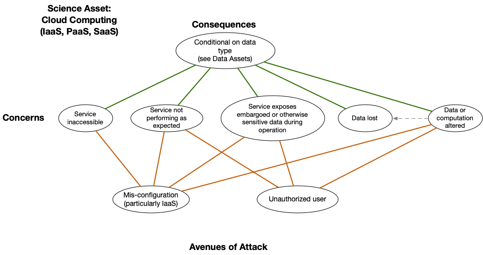

# Servers

*Asset Type:*  Cloud

Cloud infrastructure is now widely used in science.  This infrastructure is typically broken down into Software as a Service (SaaS),
Platform as a Service (PaaS), Infrastructure as a Service (IaaS).  Examples of SaaS include Dropbox, GitHub, Google Apps, and Salesforce.  Examples of PaaS include AWS Elastic Beanstalk, Google App Engine, Microsoft Windows Azure, and Red Hat OpenShift. Examples of IaaS include Amazon Web Services, Google Cloud Platform, and Microsoft Azure.

A benefit of all of these services, at least on the major cloud platforms, includes typically very high robustness against network denial of service attacks, very high server reliability and uptime, and much less concern about physical security of the systems.

At the same time, each of these types of infrastructure has different security properties.  While all rely on the security of the underlying system being run, and also on proper access controls and authentication, IaaS involves running an entire operating system, and so therefore requires substantially more security of the installation and configuration of that operating system

