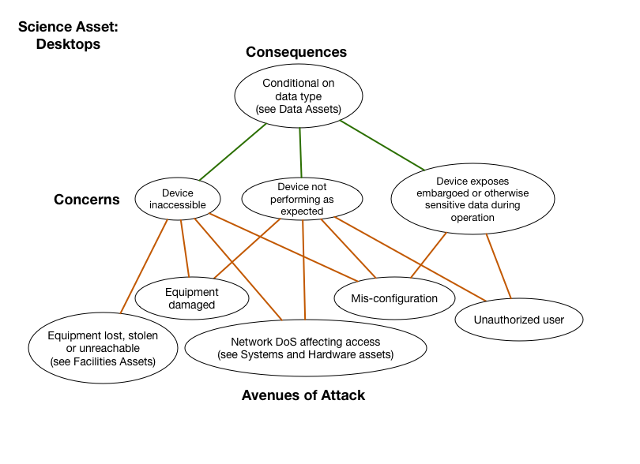

# Desktops

*Asset Type:*  Project hardware

Systems within a project's cyberinfrastructure used to access, store,
generate or manipulate data or other science assets in the typical
desktop sense.  The desktop includes the physical hardware, software and
middleware, as well as any configuration management associated with it.

