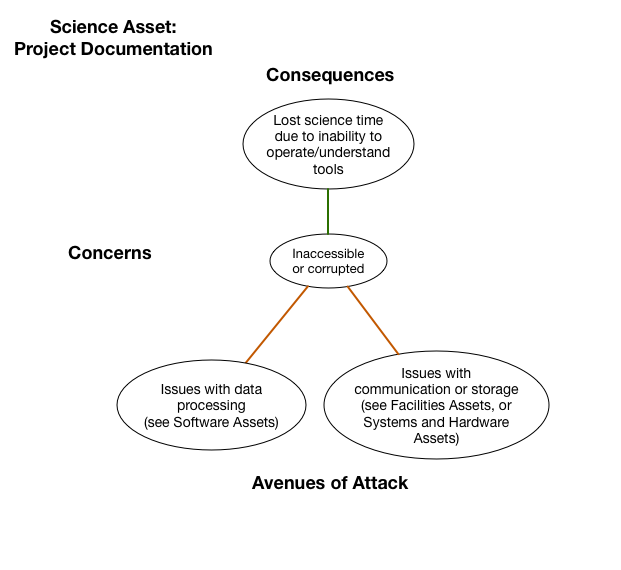

# Documentation

*Asset Type:*  Project documentation

Any type of informational data, e.g., manuals, wikis, blogs, etc. that facilitate the production, post-processing or management of the science project.

