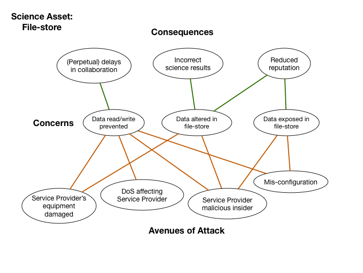

# File Store

*Asset Type:*  System

Any system used to store/archive data assets.  This includes the physical hardware, software and in some cases, e.g., external cloud services such as Amazon S3 or Google Drive, their local networks as well.

