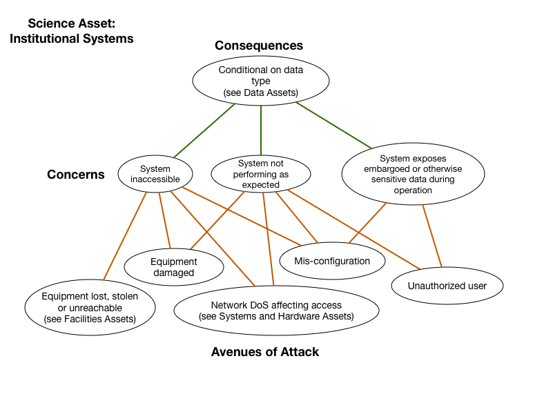

# Institutional Systmes

*Asset Type:*  Facilities

Systems outside a project's threat profile, but a critical compononet in the science process.  This includes staff workstations, laptops, networks, supercomputers, emailing lists, calendar services etc.  Note, the consequences

