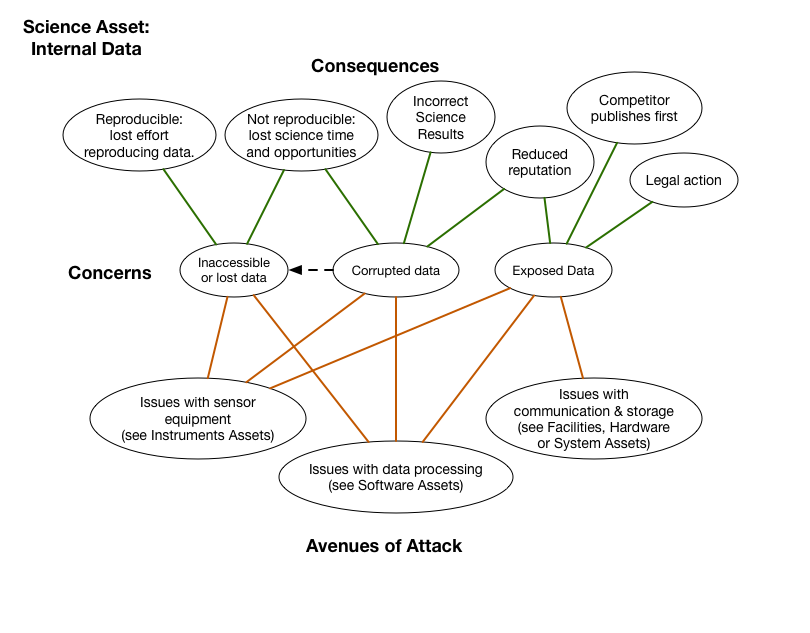

# Internal Data

*Asset Type:* Project data

Any type of data element that is never intended for publication.  This includes: raw instrument data, post-processed results, notes and memorandum, or e-mail.  Data assets should be considered both while they are on storage systems or while they are in transit.

