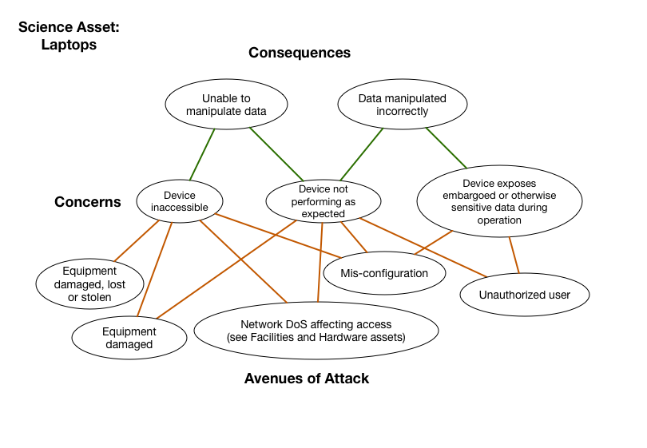

# Laptops

*Asset Type:*  Project hardware

Portable systems within a project's cyberinfrastructure used to
access, store, generate or manipulate data or other science assets in
the typical portable desktop sense.  The laptop includes the physical
hardware, software and middleware, as well as any configuration
management associated with it.

