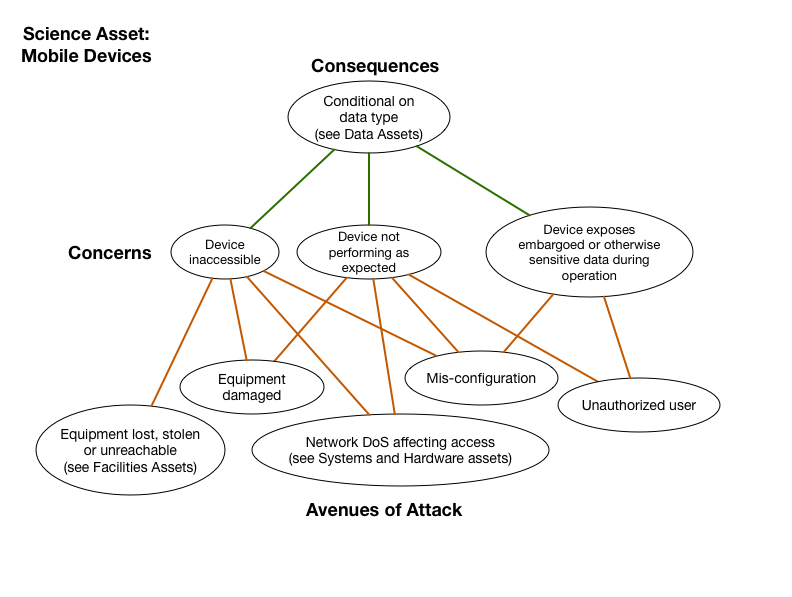

# Mobile Devices

*Asset Type:*  Project or personnel hardware

Systems within a project's cyberinfrastructure used to access data or other sceince assets in the typical
mobile device sense.  The mobile devices includes the physical hardware, software and
middleware, as well as any configuration management associated with it.

