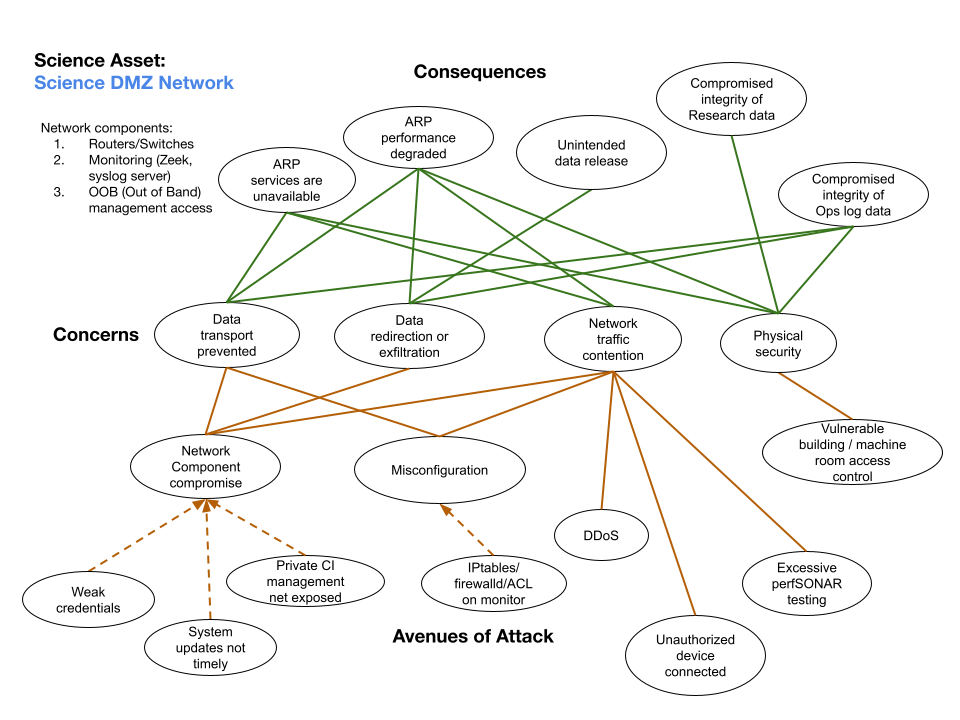
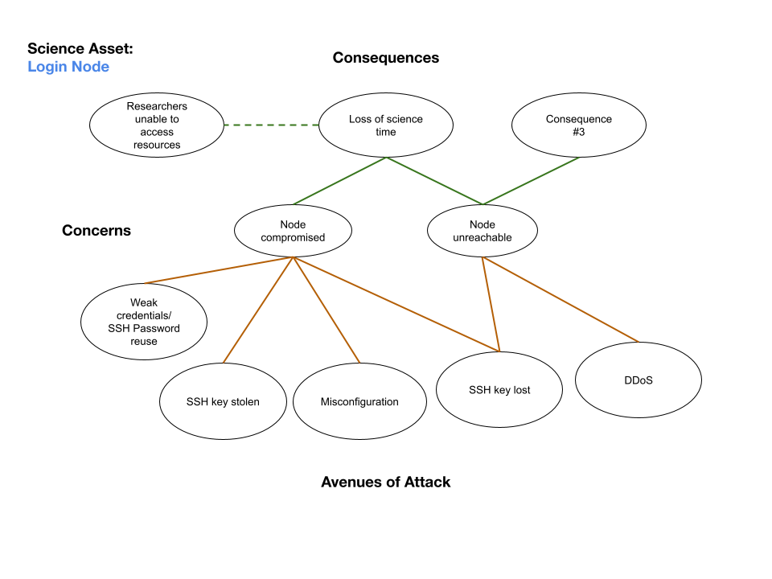
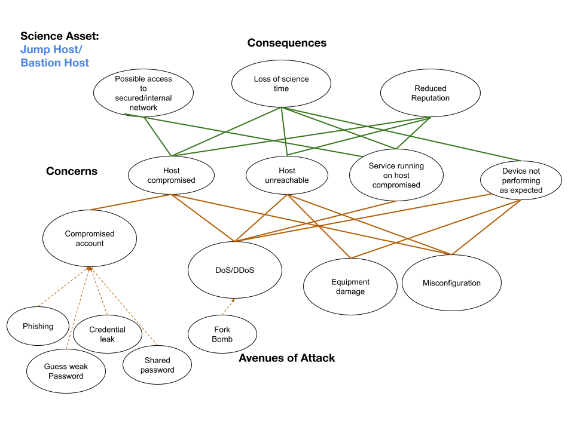

# Elements of a Science DMZ

*Asset Type:*  Project hardware and software

A Science DMZ is a portion of the network, built at or near the network perimeter of a research institution for high-performance workflows and large datasets. It is designed such that the equipment, configuration, and security policies are optimized for high-performance scientific applications rather than for general-purpose enterprise computing.

Some of the common components of Science DMZ network include: Jump Host, Login Node, Data Transfer Node (DTN), perfSONAR and the Science DMZ Network itself. These diagrams help identify some of the common concerns, consequences and avenues of attack for Science DMZ components.

## Science DMZ Network
 

## perfSONAR

## Login Node

## Jump Host/Bastion Host

## Science DMZ Data Transfer Node (DTN)

.png)

